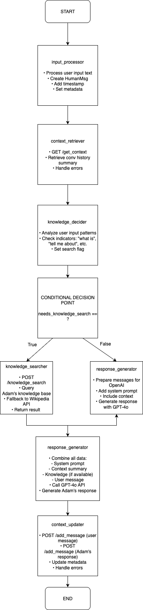

# Adam NPC LangGraph + MCP System

An advanced **Model Context Protocol (MCP)** implementation for Adam, a wise centuries-old sage NPC. Built with **LangGraph workflow orchestration + FastMCP + FastAPI** for sophisticated dialogue management and powered by **GPT-4o** for superior response quality.

## Quick Start

### Prerequisites
- Python 3.11+
- OpenAI API key with GPT-4o access

### Installation
```bash
# Clone the repository
git clone https://github.com/bhargav1000/Adam-NPC-MCP.git
cd Adam-NPC-MCP

# Install dependencies
pip install -r requirements.txt

# REQUIRED: Set your OpenAI API key (needed for GPT-4o)
export OPENAI_API_KEY="your-openai-api-key-here"
```

### Running the System

**Start the MCP Server:**
```bash
python mcp_server.py
```
Server will auto-detect the appropriate transport (stdio/http/sse).

**Start Interactive Chat:**
```bash
python mcp_client.py
```

The client runs as an interactive CLI interface with LangGraph workflow orchestration.

## Architecture

### LangGraph + FastMCP + FastAPI Design
- **LangGraph Workflow**: Sophisticated dialogue orchestration with structured state management
- **MCP Server**: FastMCP server with proper MCP tools and resources
- **MCP Client**: LangGraph-powered client with workflow-based response generation
- **True MCP Protocol**: Proper Model Context Protocol implementation

### Key Components
1. **LangGraph Workflow Orchestration**: Structured dialogue processing with nodes for input, context, knowledge search, and response generation
2. **GPT-4o Integration**: Advanced language model for superior dialogue quality
3. **Conversation Memory**: Token-aware context management with intelligent summarization (4K limit)
4. **Knowledge Tool**: Built-in knowledge base + Wikipedia fallback with workflow-based decision making
5. **Character Consistency**: Adam's sage persona maintained across conversations through workflow state management

### LangGraph Workflow Architecture


The workflow orchestrates dialogue through 6 processing nodes:
1. **input_processor** - Process user input and create messages
2. **context_retriever** - Get conversation context from MCP server  
3. **knowledge_decider** - Intelligent decision for knowledge search
4. **knowledge_searcher** - Search Adam's knowledge base + Wikipedia (conditional)
5. **response_generator** - Generate Adam's response with GPT-4o
6. **context_updater** - Update conversation state on MCP server

## API Reference

### MCP Server Tools and Resources

**MCP Tools (callable via FastMCP):**
| Tool | Purpose |
|------|---------|
| `add_message` | Add message to conversation context |
| `get_context` | Retrieve conversation history and summary |
| `knowledge_search` | Search Adam's knowledge base and Wikipedia |
| `summarize_history` | Generate conversation summary |
| `reset_conversation` | Clear conversation context |
| `get_health_status` | Server health check with Adam's knowledge topics |

**MCP Resources:**
| Resource URI | Purpose |
|--------------|---------|
| `adam://character/profile` | Adam's character information and background |

### LangGraph Workflow Integration

The client uses LangGraph workflow orchestration for sophisticated dialogue processing:
- **Structured State Management**: TypedDict-based conversation state
- **Conditional Logic**: Intelligent knowledge search decisions
- **Error Handling**: Graceful fallbacks at each workflow node
- **MCP Integration**: Seamless tool calls to MCP server endpoints

### Example Usage

**Chat with Adam (via CLI):**
```bash
python mcp_client.py
# Interactive session starts
You: Tell me about the Northern Isles
Adam: Ah, the Northern Isles... [Adam's response with LangGraph orchestration]
```

**Direct MCP Tools (using FastMCP client):**
```python
from fastmcp import Client

async with Client("http://localhost:8000") as client:
    # Call MCP tools
    result = await client.call_tool("knowledge_search", {"query": "magic systems"})
    
    # Access MCP resources
    profile = await client.read_resource("adam://character/profile")
```

## Adam's Character

**Adam** is a wise, centuries-old sage from the mystical Northern Isles, based on a character scenario once imagined by the creator. He possesses:
- Deep knowledge of magic and arcane arts
- Thoughtful, slightly archaic speech patterns
- Interest in learning about the modern world
- Mysterious background and vast experience
- An ancient wisdom developed over centuries of study

**Sample Interactions:**
```
You: What can you tell me about magic?
Adam: Ah, magic... In the Northern Isles, I have witnessed magic flow through ancient ley lines like rivers of starlight. It responds not to force, but to understanding and respect for the natural order.

You: How long have you lived?
Adam: Time flows differently in the Northern Isles, young one. I have seen seasons turn to centuries, watched empires rise and fall like morning mist. But tell me, what wisdom do you seek from this old sage?
```

## Development

### Project Structure
```
adam-npc-mcp/
├── adam_langgraph_workflow.py  # LangGraph workflow orchestration
├── mcp_server.py              # MCP server with FastAPI-MCP integration
├── mcp_client.py              # LangGraph-powered MCP client
├── requirements.txt           # Dependencies including LangGraph
└── README.md                  # Documentation
```

### Key Features
- **LangGraph Workflow Orchestration**: Sophisticated dialogue state management with conditional edges and structured flow
- **GPT-4o Powered**: Advanced language model for superior dialogue quality
- **True MCP Implementation**: FastMCP server with proper tools and resources
- **Modern Python**: Requires Python 3.11+ for optimal performance
- **Workflow State Management**: Structured conversation state with input processing, context retrieval, knowledge decisions, and response generation
- **Intelligent Tool Selection**: Conditional workflow edges for knowledge search based on user input patterns
- **Context Injection**: MCP Context object for logging and progress reporting
- **Token Management**: Automatic conversation summarization at 4K tokens
- **Robust Knowledge Tool**: Local knowledge + Wikipedia fallback with workflow-based decision making
- **Fallback Mechanisms**: Graceful degradation when workflow components fail

### Adding New Knowledge
Edit the `ADAM_KNOWLEDGE_BASE` dictionary in `mcp_server.py` (based on the creator's original character concept):
```python
ADAM_KNOWLEDGE_BASE = {
    "new_topic": "Information about the new topic...",
    # ... existing entries
}
```

## Testing

**Test Individual Components:**
```bash
# Test server health
curl http://localhost:8000/health

# Test knowledge tool
curl -X POST http://localhost:8000/knowledge_search \
  -H "Content-Type: application/json" \
  -d '{"query": "wisdom"}'

# Test LangGraph workflow
python mcp_client.py
# Type: "Tell me about wisdom"
```

### Interaction Transcripts
Interaction transcripts of up to 8 turns are recorded here:
1. Raw Interaction: [Raw Transcript](interaction_transcript.txt)
2. Cleaned Version: [Clean Transcript](interaction_transcript_clean.txt)

3 instances of factual lookups using tool calls have been recorded.

## Configuration

### Environment Variables
```bash
export OPENAI_API_KEY="your-key-here"      # Required - must have GPT-4o access
export MCP_SERVER_URL="http://localhost:8000"  # Optional, defaults to localhost:8000
```

### Server Configuration
The MCP server auto-detects the appropriate transport (stdio/http/sse).
Configuration can be modified in `mcp_server.py` if needed.

## 📊 Monitoring

### Health Checks
- Server: `GET /health` - Check MCP server status
- Client: Built-in health check during startup (connects to MCP server)

### Conversation Metrics
- Token count tracking
- Message history length
- Knowledge tool usage frequency

## Troubleshooting

### Common Issues

**"OpenAI API key not found"**
```bash
export OPENAI_API_KEY="your-key-here"
# Note: Requires an API key with GPT-4o access
```

**"Connection refused"**
- Ensure MCP server is running: `python mcp_server.py`
- Check server logs for errors
- Verify the MCP transport is working properly

**"MCP import error"**
```bash
pip install mcp
```

### Getting Help
1. Check server logs in the terminal running `python mcp_server.py`
2. Visit `http://localhost:8000/docs` for interactive MCP server API documentation
3. Test individual endpoints with curl commands above
4. Run `python mcp_client.py` and type 'help' for interactive commands


### ✅ Implementation Requirements
- **LangGraph Workflow**: ✅ Sophisticated dialogue orchestration with 6 processing nodes
- **MCP Server**: ✅ FastAPI + FastMCP architecture with proper tools
- **MCP Client**: ✅ LangGraph-powered client with workflow orchestration  
- **Token Management**: ✅ 4K limit with intelligent auto-summarization
- **Tool Integration**: ✅ Knowledge search with Wikipedia fallback
- **Character Consistency**: ✅ Adam's sage persona maintained through workflow state
- **Conversation Memory**: ✅ Context-aware dialogue management

### ✅ Technical Features
- **LangGraph Orchestration**: Structured workflow with conditional edges and state management
- **GPT-4o Integration**: State-of-the-art language model for superior responses
- **Python 3.11+ Compatible**: Modern Python features and performance optimizations
- **Modern Architecture**: LangGraph + FastAPI + FastMCP for sophisticated dialogue management
- **Auto-reload**: Development-friendly server
- **Interactive Docs**: Built-in API documentation at `/docs`
- **Health Monitoring**: Server health checks and client startup validation
- **Error Handling**: Graceful fallbacks at each workflow node
- **Structured Logging**: Comprehensive logging throughout workflow execution

---

**Built with LangGraph + FastMCP + FastAPI + GPT-4o** 🚀